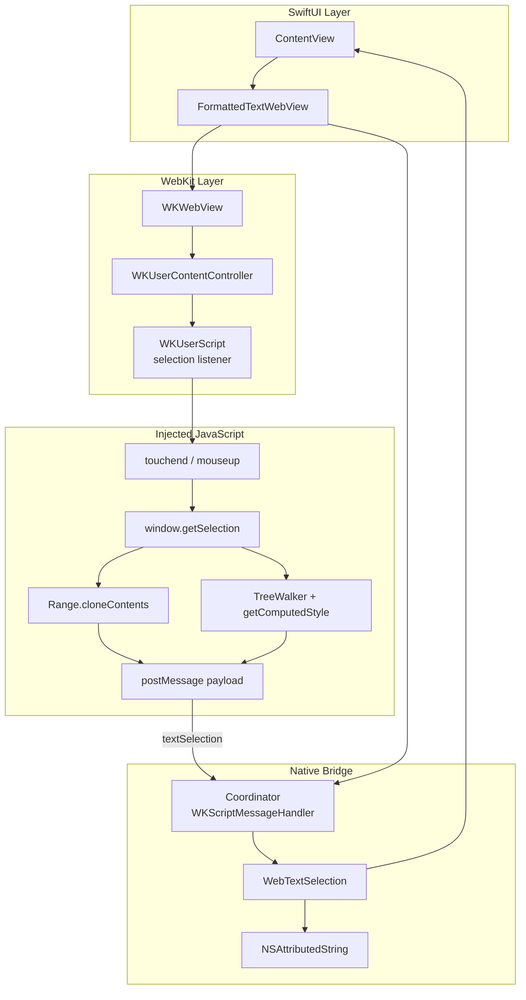
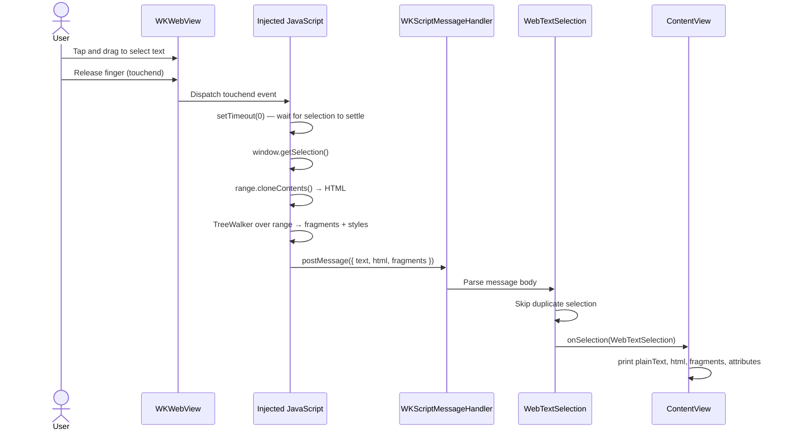
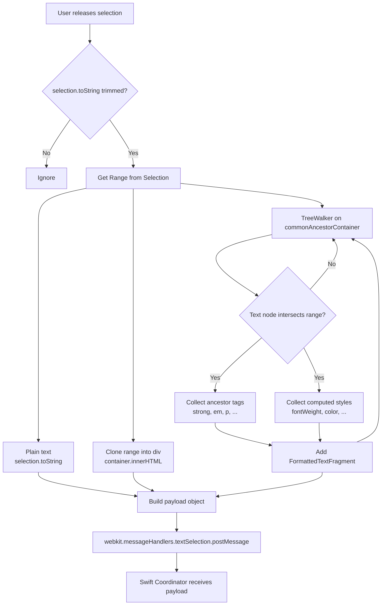
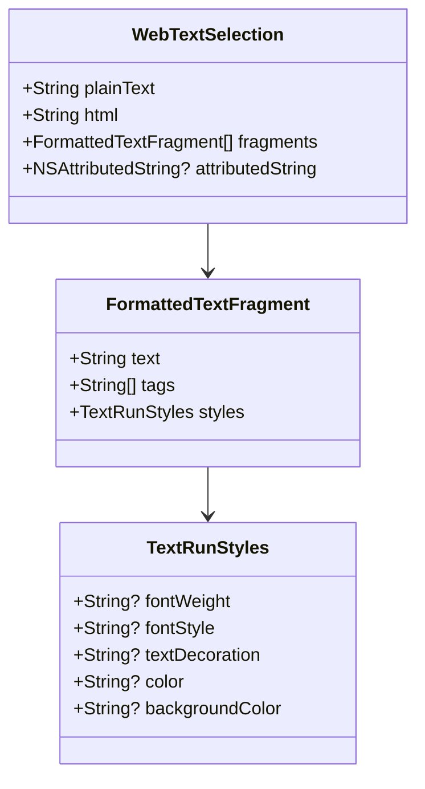

# webkit-selection

An iOS example app that displays formatted HTML inside `WKWebView` and captures **plain text**, **HTML**, and **formatting metadata** when the user selects content.

## Overview

Native iOS apps cannot read WebKit text selection directly from Swift. This project bridges the web layer and the native layer using:

- **WKWebView** — renders HTML content
- **WKUserScript** — injects JavaScript at document load
- **WKScriptMessageHandler** — receives selection payloads from JavaScript
- **SwiftUI `UIViewRepresentable`** — embeds the web view in the app UI

When the user finishes a selection (`touchend` / `mouseup`), JavaScript reads the DOM selection, builds a structured payload, and posts it to native code. Swift parses the payload into `WebTextSelection` and can optionally convert the HTML fragment to `NSAttributedString`.

## Tech Stack

| Layer | Technology |
|-------|------------|
| UI | SwiftUI |
| Web engine | WebKit (`WKWebView`) |
| Bridge | `WKUserContentController` + `WKScriptMessageHandler` |
| Selection API (web) | `window.getSelection()`, `Range`, `TreeWalker`, `getComputedStyle` |
| Rich text (native) | `NSAttributedString` (HTML import) |
| Platform | iOS 26.2+ |

## Project Structure

```
webkit-selection/
├── webkit_selectionApp.swift   # App entry point
├── ContentView.swift           # Hosts the web view, logs selection output
└── FormattedTextWebView.swift  # WKWebView wrapper, JS bridge, data models
```

## Architecture



## Selection Flow

End-to-end flow from user gesture to console output:



## JavaScript Extraction Flow

Detailed steps inside the injected script:



## Data Model



### Payload shape (JavaScript → Swift)

```json
{
  "text": "bold highlights",
  "html": "<strong>bold highlights</strong>",
  "fragments": [
    {
      "text": "bold highlights",
      "tags": ["strong", "p"],
      "styles": {
        "fontWeight": "700",
        "fontStyle": "normal",
        "textDecoration": "none",
        "color": "rgb(0, 122, 255)",
        "backgroundColor": "rgba(0, 0, 0, 0)"
      }
    }
  ]
}
```

## Technical Approach

### 1. Embed WKWebView in SwiftUI

`FormattedTextWebView` conforms to `UIViewRepresentable`. It creates a `WKWebView`, loads HTML via `loadHTMLString(_:baseURL:)`, and wires a `Coordinator` as the script message handler.

### 2. Inject selection listener

A `WKUserScript` runs at `.atDocumentEnd` and registers:

- `document.addEventListener('touchend', reportSelection)` — iOS touch
- `document.addEventListener('mouseup', reportSelection)` — pointer / simulator

`reportSelection` uses `setTimeout(..., 0)` so the browser finishes updating the selection before reading it.

### 3. Read plain text

```javascript
window.getSelection().toString().trim()
```

Uses the standard DOM Selection API. Returns a flat string with no markup.

### 4. Read HTML fragment

```javascript
var range = selection.getRangeAt(0);
var container = document.createElement('div');
container.appendChild(range.cloneContents());
var html = container.innerHTML;
```

`Range.cloneContents()` copies the selected DOM subtree. Wrapping it in a container element produces an HTML string that preserves tags such as `<strong>`, `<em>`, and `<code>`.

### 5. Read formatting metadata

For each text node inside the range:

1. **Ancestor tags** — walk `parentElement` up to `<body>` to record semantic HTML tags.
2. **Computed styles** — call `window.getComputedStyle(element)` for resolved CSS (`fontWeight`, `fontStyle`, `color`, etc.).

A `TreeWalker` with a custom `acceptNode` filter skips nodes outside the range and empty text nodes.

### 6. Bridge to Swift

```javascript
window.webkit.messageHandlers.textSelection.postMessage(payload);
```

On the native side, `Coordinator` implements `WKScriptMessageHandler` and maps the dictionary body to `WebTextSelection`.

Duplicate payloads are suppressed by comparing the last reported `WebTextSelection` (handles selection handle adjustments without text change).

### 7. Convert to native rich text (optional)

`WebTextSelection.attributedString` wraps the HTML fragment in a minimal document and uses:

```swift
NSAttributedString(
    data: htmlData,
    options: [.documentType: .html],
    documentAttributes: nil
)
```

This produces a UIKit-ready attributed string for labels, text views, or share sheets.

## Key APIs Reference

### Web (JavaScript)

| API | Purpose |
|-----|---------|
| `window.getSelection()` | Access current user selection |
| `Selection.getRangeAt(0)` | Get DOM range for the selection |
| `Range.cloneContents()` | Copy selected nodes as a `DocumentFragment` |
| `Range.intersectsNode()` | Test whether a node is part of the selection |
| `document.createTreeWalker()` | Iterate text nodes inside the range |
| `window.getComputedStyle()` | Read resolved CSS for an element |
| `window.webkit.messageHandlers.*.postMessage()` | Send data to native code |

### Native (Swift / WebKit)

| API | Purpose |
|-----|---------|
| `WKWebView` | Display web content |
| `WKWebViewConfiguration` | Configure the web view |
| `WKUserContentController` | Register scripts and message handlers |
| `WKUserScript` | Inject JavaScript at document load |
| `WKScriptMessageHandler` | Receive messages from JavaScript |
| `UIViewRepresentable` | Integrate UIKit web view into SwiftUI |
| `NSAttributedString` (HTML) | Parse HTML fragment into native rich text |

## Why This Approach

| Alternative | Limitation |
|-------------|------------|
| Observe `UIPasteboard` | Only fires on copy, not on select |
| Native `UITextView` | Cannot render arbitrary HTML/CSS |
| `selectionchange` event alone | Fires too often; hard to know when selection is final |
| Swift-only WKWebView APIs | No public API to read selection from Swift |

The **JavaScript bridge** pattern is the standard solution: the web engine owns selection state; JavaScript reads it and forwards structured data to the app.

## Limitations

- **Partial text nodes** — when a selection starts or ends mid-node, `textContent` of that node may include characters outside the visible selection.
- **Cross-element selections** — HTML fragment reflects structure but may not match exact visual line breaks.
- **Computed styles only** — returned styles are resolved CSS values, not original stylesheet rules.
- **Main frame only** — script is injected with `forMainFrameOnly: true`; iframe selections are not captured.
- **HTML → NSAttributedString** — conversion is best-effort; complex CSS may not map perfectly to UIKit attributes.

## Getting Started

### Requirements

- Xcode 26.3+
- iOS 26.2+ simulator or device

### Run

1. Open `webkit-selection.xcodeproj` in Xcode.
2. Select an iOS simulator or connected device.
3. Press **Run** (⌘R).
4. Select text in the web view.
5. Inspect the Xcode debug console for output:

```
[WebView selection] text: bold highlights
[WebView selection] html: <strong>bold highlights</strong>
[WebView selection] fragment 0: "bold highlights" tags=strong > p styles=weight=700, ...
```

## Extending

Common next steps:

- Replace `print` with a callback to copy, share, or highlight in native UI
- Debounce or listen to `selectionchange` for live selection previews
- Add `selectionchange` + `touchend` together for handle-drag updates
- Persist selections or send them to a backend API
- Load remote HTML instead of `SampleFormattedHTML.content`

## License

Example project for exploring WebKit text selection on iOS.
