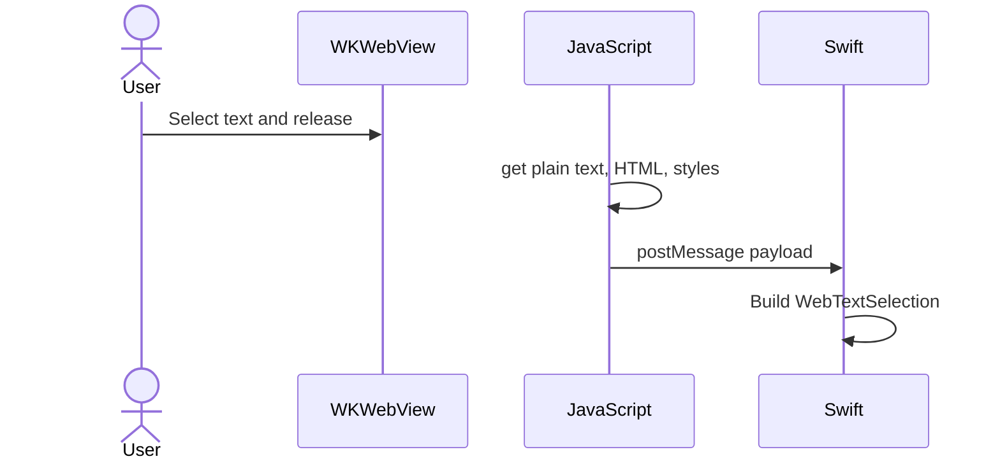

# ios-webkit-selection

An iOS demo app that shows formatted HTML in a web view and reads what the user selects — including **plain text**, **HTML**, and **styles**.

## The problem

Swift cannot read text selection from `WKWebView` directly. The web page owns the selection, so we use **JavaScript to read it** and send the result back to Swift.

## How it works

1. `WKWebView` loads HTML content.
2. Injected JavaScript listens for `touchend` / `mouseup`.
3. JS reads the selection and sends a payload to Swift.
4. Swift maps it to `WebTextSelection` and logs (or uses) the result.

### Selection flow



## What you get

Each selection returns a `WebTextSelection` object:

| Field | Description |
|-------|-------------|
| `plainText` | Selected text without formatting |
| `html` | HTML fragment (keeps `<strong>`, `<em>`, etc.) |
| `fragments` | Text runs with HTML tags and CSS styles |
| `attributedString` | Optional `NSAttributedString` for native UI |

Example payload:

```json
{
  "text": "bold highlights",
  "html": "<strong>bold highlights</strong>",
  "fragments": [{ "text": "bold highlights", "tags": ["strong", "p"], "styles": { "fontWeight": "700" } }]
}
```

## Tech used

- **SwiftUI** + `UIViewRepresentable` — embed the web view
- **WKWebView** — render HTML
- **WKUserScript** — inject the selection listener
- **WKScriptMessageHandler** — receive data from JavaScript
- **DOM APIs** — `getSelection()`, `Range.cloneContents()`, `getComputedStyle()`

## Project files

```
webkit-selection/
├── ContentView.swift           # Shows the web view, prints selection
└── FormattedTextWebView.swift  # Web view wrapper + JS bridge + models
```

## Run the app

1. Open `webkit-selection.xcodeproj` in Xcode.
2. Run on a simulator or device (⌘R).
3. Select text in the web view.
4. Check the Xcode console:

```
[WebView selection] text: bold highlights
[WebView selection] html: <strong>bold highlights</strong>
```

**Requirements:** Xcode 26.3+, iOS 26.2+

## Notes

- Selection is read when the user **releases** their finger, not while dragging.
- Works on the **main frame only** (not iframes).
- HTML → `NSAttributedString` conversion is best-effort for complex CSS.
